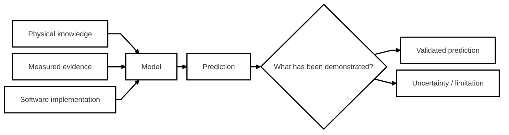
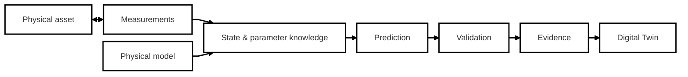
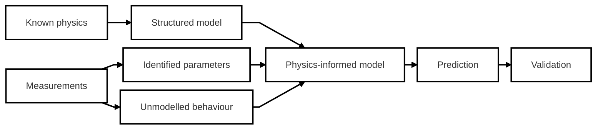
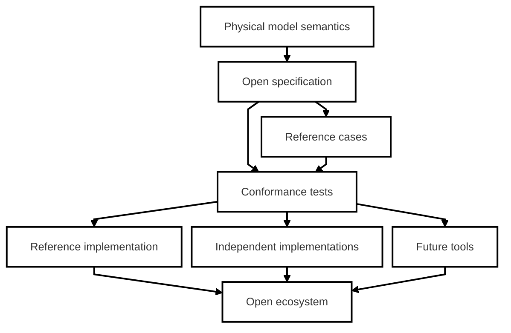
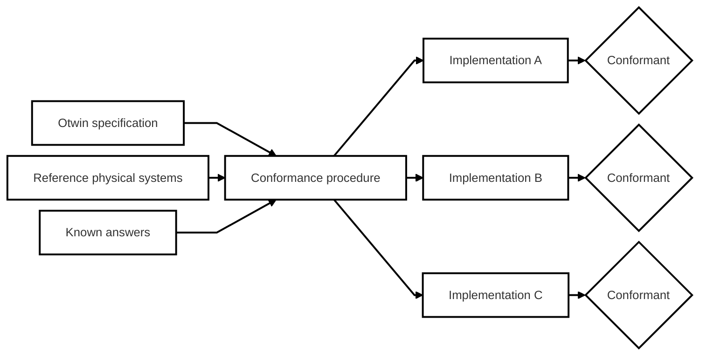
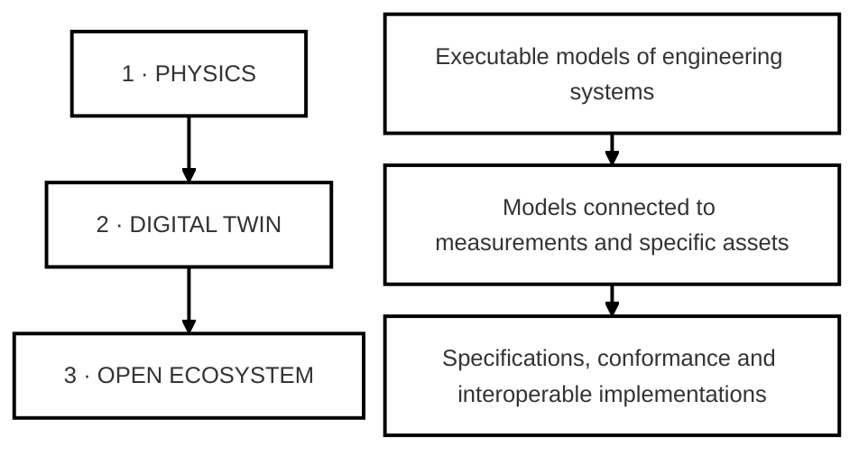
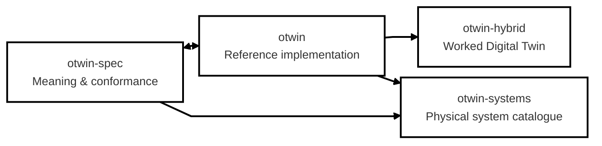
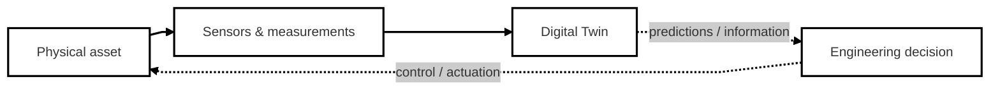
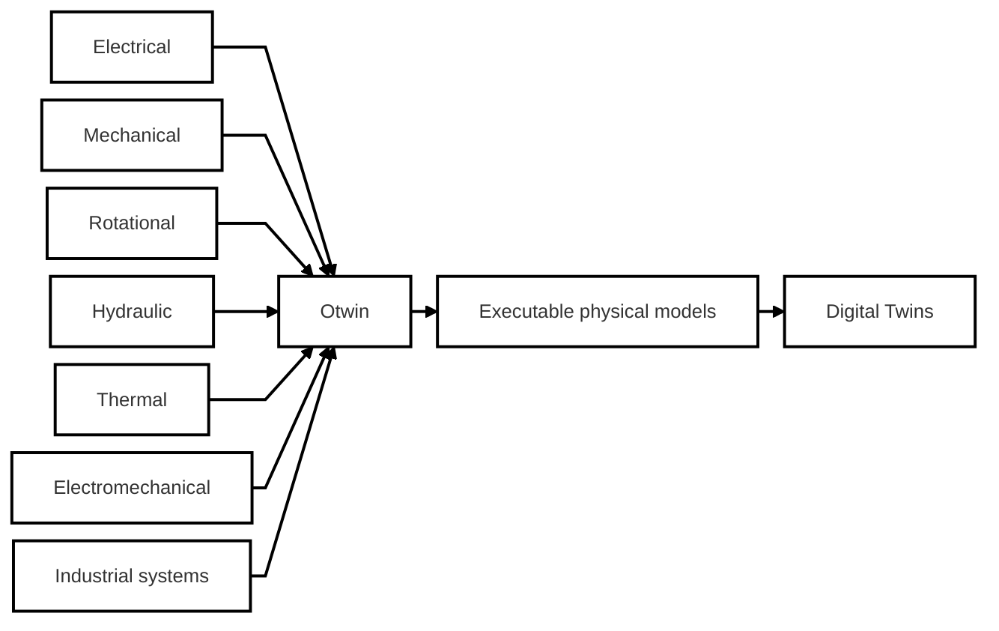
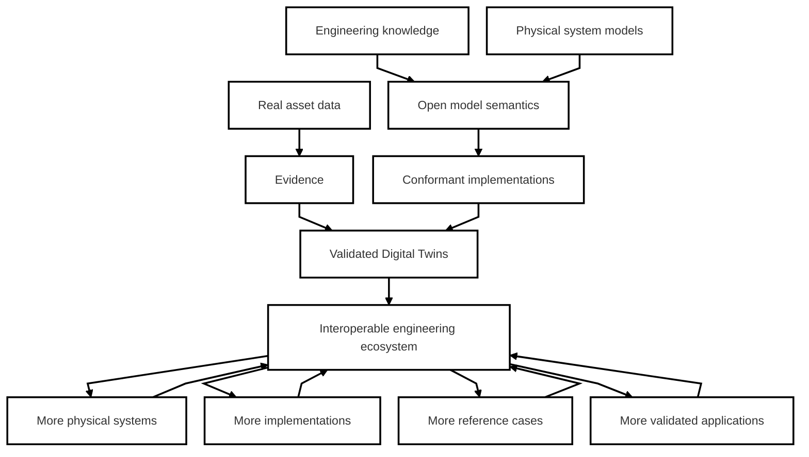

<div align="center">


# Otwin: an open-source foundation for physics-informed Digital Twins


<br>

[](https://opensource.org/license/apache-2-0)
[](https://github.com/otwin-core/)
[](https://github.com/otwin-core/)

[](https://github.com/otwin-core/otwin/actions/workflows/rust.yml)
[](https://github.com/otwin-core/otwin/actions/workflows/ci.yml)
[](https://www.bestpractices.dev/projects/14061)
[](https://scorecard.dev/viewer/?uri=github.com/otwin-core/otwin)
[](https://api.reuse.software/info/github.com/otwin-core/otwin)
[](https://github.com/otwin-core/otwin/attestations)


<br>

[The idea](#the-idea) ·
[Why Otwin](#why) ·
[The ecosystem](#an-open-ecosystem-not-a-closed-product) ·
[Specification](#the-otwin-specification) ·
[Repositories](#what-the-project-provides) ·
[Status](#current-status) ·
[Contributing](#contributing)

</div>

<br>

# The idea

Engineering is increasingly built around models. Models of batteries. Motors. Power systems. Pumps. Thermal networks. Industrial processes. But a model becomes much more valuable when it can remain connected to the physical system it represents — and when its predictions can be tested against evidence. **Otwin is building an open foundation for that.**

We want physical models to be:

- **executable**, not just equations on paper;
- **connected to real assets**, not isolated simulations;
- **calibrated from measurements**, without throwing away known physics;
- **validated out of sample**, rather than judged only by how well they fit history;
- **explicit about uncertainty and limits**;
- **portable across implementations and languages**;
- **open enough that the meaning of a model can be checked independently of the software that runs it.**

The ambition is bigger than a Python library.

#### We want to make physics-informed Digital Twins an open, testable and interoperable engineering technology.

<br>

# Why

A Digital Twin is often presented as a combination of simulation, data and AI. The harder problem is deciding **what the resulting model is actually entitled to claim**. A model can reproduce historical data and still fail when the operating conditions change. A model can report an impressive accuracy number without demonstrating that it can forecast. A model can produce a confident prediction far outside the conditions under which it was validated. And two implementations can appear to represent the same physical model while quietly behaving differently.

#### Physical knowledge, measured evidence and software implementations should all be testable.

That means separating three things that are too often mixed together:



The result should not simply be a model that produces an answer. It should be a model that can explain **why that answer is supported — and when it is not**.

<br>

# From model to Digital Twin

Otwin treats a Digital Twin as more than a simulation model.

|Simulation|Digital Twin|
|---|---|
|*What does this model do?*|*What is this particular asset doing, what is it likely to do next, and what evidence supports that prediction?*|




Otwin provides the open-source building blocks across that chain:

<div align="center">

```
model → connect → estimate → calibrate → predict → quantify → validate
```

</div>

The objective is not to replace engineering judgement. It is to provide engineers a stronger foundation on which to exercise it.

<br>

# Physics-informed, not physics-exclusive

Real engineering systems are only partly known. Some behaviour is described by well-established physical laws. Other behaviour depends on parameters that must be identified from measurements. Some phenomena are difficult or impossible to model from first principles. Otwin therefore does not treat physics and data as competing approaches. It treats them as complementary sources of knowledge.



#### Keep the physics you know. Learn what you do not know. Test both. This creates a path between first-principles engineering models and purely data-driven approaches without requiring the system to become a black box.

<br>

# An open ecosystem, not a closed product

The long-term vision for Otwin is an ecosystem in which physical models can move between tools, implementations and organisations without losing their meaning. That requires more than an API. It requires a common definition of what a model means, objective ways of checking implementations, and reference cases against which physical behaviour can be verified.



This is why the Otwin project is organised as an ecosystem of repositories rather than a single package.

<br>

# The Otwin specification

`otwin-spec` defines the contract and provides a normative specification and a language-independent conformance procedure for implementations of the Otwin model form. A physical model should not be considered correct merely because one piece of software produces plausible numbers. Instead, the project should be able to define:

1. what the model means;
2. which physical properties must hold;
3. which reference systems demonstrate those properties;
4. what answers an implementation must produce;
5. how an independent implementation can prove that it conforms.



The conformance procedure operates independently of the implementation. That makes it possible to build implementations in different languages without making one particular software stack the definition of the model. Today, the primary implementation is Python. The ambition is an ecosystem of conformant implementations (Julia, R, Mathlab).

<div align="center">

[Explore Otwin Specifications](https://github.com/otwin-core/otwin-spec)

</div>

<br>

# One vision, three layers

The project can be understood as three increasingly valuable layers.



1. Physics. Represent real engineering systems in a form that can be executed, inspected and tested.
2. Digital Twins. Keep those models connected to real assets, use measurements to update what is known, and evaluate what the model predicts.
3. Open ecosystem. Define the meaning of the models independently from a single implementation and make conformance objectively testable.


# What the project provides

| Repository | Role |
|---|---|
| [**`otwin`**](https://github.com/otwin-core/otwin) | The reference Python implementation: physical modeling, execution, estimation, calibration, forecasting, validation and field connectivity |
| [**`otwin-spec`**](https://github.com/otwin-core/otwin-spec) | The normative specification and language-independent conformance suite |
| [**`otwin-hybrid`**](https://github.com/otwin-core/otwin-hybrid) | A worked example of building a physics-informed Digital Twin of lithium-ion battery degradation |
| [**`otwin-systems`**](https://github.com/otwin-core/otwin-systems) | A growing catalogue of physical systems and reference results |

Together they form the beginning of the Otwin ecosystem:



# What makes Otwin different

* It starts from the physical system. The starting point is not a dataset it is the engineering system itself.
* It does not force a choice between physics and data. Known physics remains part of the model. Measurements are used where knowledge is incomplete.
* It treats validation as part of the lifecycle. A model is not finished when it produces a forecast if it's not tested.
* It makes uncertainty part of the result. A prediction without an understanding of its uncertainty and limits is incomplete.
* It can refuse unsupported questions. A Digital Twin should not silently extrapolate beyond the evidence established for it.
* It aims to make physical claims independently checkable. The specification and conformance suite are intended to make model semantics and physical properties testable independently of one implementation.

# The model-to-asset boundary

A Digital Twin ultimately interacts with a real physical system. Otwin focuses on the **asset-to-model** direction:



Otwin is deliberately not an asset-control platform. The project provides the modeling, estimation, prediction and validation foundation.
Closed-loop actuation belongs alongside the control architecture, operational constraints and safety case of the system in which the Digital Twin is deployed. This separation is intentional.

# A foundation for many engineering domains

The same ideas should apply across physical domains.



The project is therefore not centred on one particular asset class. Batteries are one example. Motors, hydraulic systems, thermal systems and larger industrial systems are part of the same vision.

# Designed for engineering evidence

Otwin is built around a simple progression:

<div align="center">

```text
Physical knowledge → Model → Measurements → Calibration → Prediction → Validation → Evidence
```
</div>

At each step, the question is not only  *Can we calculate something?* but *What do we know, how do we know it, and what are the limits of that knowledge?* This is important when models are used to support engineering decisions such as:

- [x] maintenance planning;
- [x] remaining-capacity estimation;
- [x] performance prediction;
- [x] operational planning;
- [x] design verification;
- [x] anomaly investigation;
- [x] asset comparison;
- [x] long-horizon forecasting.

# Current status

Otwin is an early-stage open-source project with a deliberately ambitious long-term direction.

| | |
|---|---|
| **Software status** | Pre-1.0; usable and tested, with breaking API changes still possible |
| **Primary implementation** | Python |
| **Execution** | Python reference backend and compiled Rust engine |
| **Specification** | `otwin-spec` |
| **Conformance** | Available through `otwin-spec` |
| **Licence** | Apache 2.0 |
| **Governance** | No formal governance structure yet |
| **Research / engineering activity** | Presented at the IEEE PES General Meeting 2026, including the Energy Storage & Stationary Battery Committee panel *AI-powered Digital Twins for Grid-Scale Energy Storage* |

The project is intentionally transparent about what exists today and what remains to be built. The specification, conformance suite and multiple-implementation architecture are the foundations from which we intend to build one.

# Where we are going

The direction is larger than adding more components to a Python package. We want to build toward an ecosystem where:



That means growing in several directions:

- more physical system domains;
- more reference models and reference results;
- stronger conformance testing;
- independent implementations;
- better interoperability;
- richer Digital Twin workflows;
- more real-world validation;
- a broader community of engineers, researchers and maintainers.

The ambition is not to create another closed simulation environment. It is to create **open infrastructure for trustworthy physical models**.

# How to start

| If you want to… | Start here |
|---|---|
| See a complete Digital Twin example | [**`otwin-hybrid`**](https://github.com/otwin-core/otwin-hybrid) |
| Build a physical model or Digital Twin | [**`otwin`**](https://github.com/otwin-core/otwin) |
| Understand the formal model definition | [**`otwin-spec`**](https://github.com/otwin-core/otwin-spec) |
| Verify an implementation | [**`otwin-spec` conformance**](https://github.com/otwin-core/otwin-spec) |
| Explore physical reference systems | [**`otwin-systems`**](https://github.com/otwin-core/otwin-systems) |

# Contributing

Otwin is intended to be built by a community. There are several particularly valuable ways to contribute.

### Physical systems

Bring a model of a real engineering system that is not yet represented. A useful contribution includes a physical reference result wherever possible, so that the model can be tested against something known.

### Reference cases

Add a physical system with a known answer to the specification. Even better: include a deliberately broken implementation and demonstrate that the conformance test catches it. A test that has never been shown to fail is weaker evidence than one that demonstrably detects the fault it was designed to catch.

### Implementations

Help bring the specification to other languages and environments. The objective criterion is straightforward. An implementation is ready when it passes the conformance suite without modification to the tests.

### Applications

Build Digital Twins of real systems and share what was learned. Real engineering cases are essential to the project because they expose where the abstractions work, where they do not, and what the specification needs to express.

### Documentation and ecosystem

Improve examples, documentation, tooling, interoperability and the developer experience. You do not have to be a specialist in every part of the project.

<div align="center">

[Contributing guide](https://github.com/otwin-core/otwin/blob/main/CONTRIBUTING.md)

</div>

# The principle behind the project

There is a temptation in AI and simulation to focus on whether a model can produce an answer. For engineering systems, that is only part of the problem. We also need to know:

* whether the model represents the system correctly;
* whether its physical structure is preserved;
* whether its parameters are actually identified;
* whether its predictions have been tested out of sample;
* whether its uncertainty has empirical meaning;
* whether the current question lies within the evidence available to the model;
* whether another implementation would mean the same thing.

Otwin is an attempt to put those questions into the software itself.

#### A Digital Twin should not only predict. It should carry evidence about why its prediction can be trusted. And when that evidence is not there it should say so.

<div align="center">
Otwin, 2026
</div>
