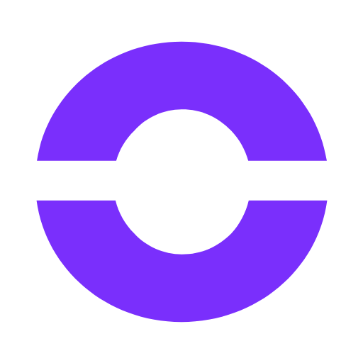
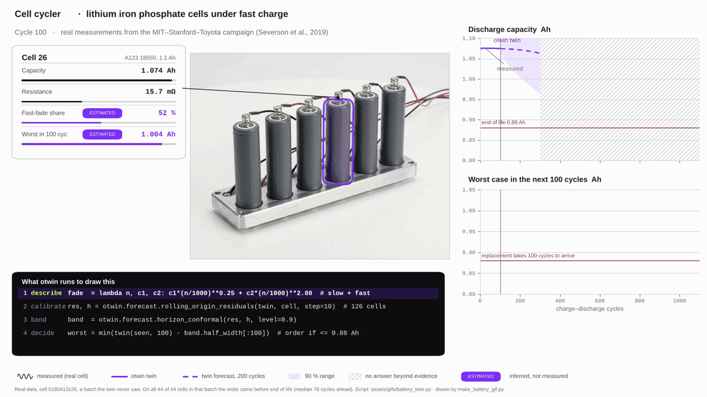
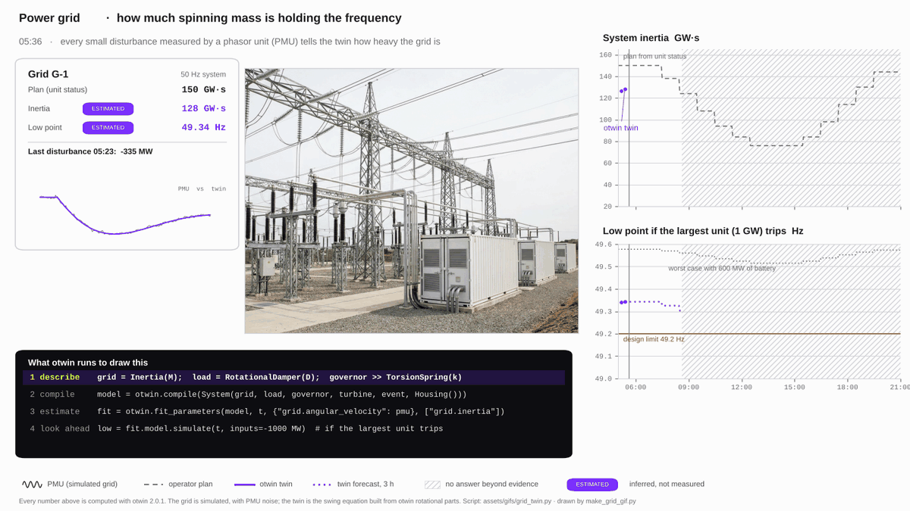
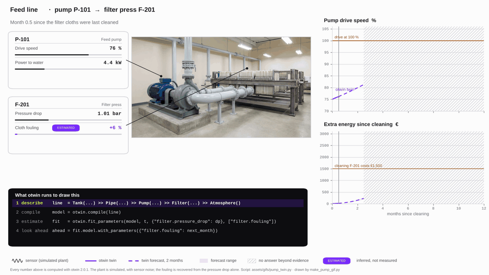

<div align="center">


<br><br>



<br>


## Welcome to the Otwin project
[](https://github.com/otwin-core/otwin/blob/main/LICENSE)

</div>

A model of a real asset or a real industrial process becomes a digital twin when it stays connected to the real machine and can say how far to trust itself. Otwin is open-source software for building those twins. You describe the equipment as components and connections, the way its drawing reads — or bring a model from Modelica or Julia — and Otwin fits it to the machine's measurements, forecasts with a range whose coverage is measured on data the model never saw, audits what the model promised against what the machine did, and refuses to answer outside what was validated. It reads the measurements from the plant itself, over Modbus, SunSpec and OPC UA.

<br>

## Where to start

```bash
pip install otwin
```

<br>

| | You want to | Start here |
|:---:|---|---|
| <picture><source media="(prefers-color-scheme: dark)" srcset="https://raw.githubusercontent.com/otwin-core/.github/main/profile/assets/brand/icons/icon-forecast-dark.svg"></picture> | **See a complete twin working** | [**`otwin-hybrid`**](https://github.com/otwin-core/otwin-hybrid), a battery degradation twin in Python, Julia and R |
| <picture><source media="(prefers-color-scheme: dark)" srcset="https://raw.githubusercontent.com/otwin-core/.github/main/profile/assets/brand/icons/icon-estimators-dark.svg"></picture> | **Try a twin on your own home, in the browser** | [**`otwin-home`**](https://github.com/otwin-core/otwin-home), a digital copy of a household built from its bills and meter readings — files never leave the computer |
| <picture><source media="(prefers-color-scheme: dark)" srcset="https://raw.githubusercontent.com/otwin-core/.github/main/profile/assets/brand/icons/icon-core-dark.svg"></picture> | **Build a model from physical parts** | [**`otwin`**](https://github.com/otwin-core/otwin), with ten [tutorials](https://github.com/otwin-core/otwin/tree/main/tutorials) that cover every component on real equipment |
| <picture><source media="(prefers-color-scheme: dark)" srcset="https://raw.githubusercontent.com/otwin-core/.github/main/profile/assets/brand/icons/icon-estimators-dark.svg"></picture> | **Check whether a model of your equipment can be trusted** | [**`otwin`**](https://github.com/otwin-core/otwin): fit, calibrate, audit and refuse, in [tutorial 10](https://github.com/otwin-core/otwin/blob/main/tutorials/10_from_model_to_twin.md) |
| <picture><source media="(prefers-color-scheme: dark)" srcset="https://raw.githubusercontent.com/otwin-core/.github/main/profile/assets/brand/icons/icon-solvers-dark.svg"></picture> | **Work in Julia** | [**`Otwin.jl`**](https://github.com/otwin-core/otwin/tree/main/julia/Otwin.jl), the same implementation with Julia types in and out |
| <picture><source media="(prefers-color-scheme: dark)" srcset="https://raw.githubusercontent.com/otwin-core/.github/main/profile/assets/brand/icons/icon-fielddata-dark.svg"></picture> | **Connect a twin to the plant** | [**`otwin`**](https://github.com/otwin-core/otwin) with the `modbus`, `sunspec` or `opcua` extras |
| <picture><source media="(prefers-color-scheme: dark)" srcset="https://raw.githubusercontent.com/otwin-core/.github/main/profile/assets/brand/icons/icon-refusal-dark.svg"></picture> | **Verify an implementation of the model format** | [**`otwin-spec`**](https://github.com/otwin-core/otwin-spec), the specification and its test suite |

<br>

<div align="center">



<sub>Real data from 44 cells the twin had never seen (Severson et al., 2019). On every one of them the replacement order came before end of life, a median of 76 cycles ahead.</sub>

<br><br>



<sub>The grid is simulated, with PMU noise; the twin is the swing equation built from Otwin's rotational parts. Across 43 small disturbances the median inertia estimate error was 1.1 %, and the twin asks for battery fast response two hours ahead. The numbers · the animation.</sub>

<br><br>



<sub>The line is built with Otwin's hydraulic parts; the cloth fouling is recovered from a pressure sensor with 2 % noise, and the cleaning is ordered when the extra energy passes its cost.</sub>

<br><br>

</div>

## Repositories

| Repository | What it is |
|---|---|
| [**`otwin`**](https://github.com/otwin-core/otwin) | The library: components in six physical domains, the port-Hamiltonian compiler, the Rust engine, estimation, forecasting, auditing and field connectors — and `Otwin.jl` inside it |
| [**`otwin-spec`**](https://github.com/otwin-core/otwin-spec) | What an Otwin model means, written down, with a test suite any implementation must pass |
| [**`otwin-hybrid`**](https://github.com/otwin-core/otwin-hybrid) | A complete example: a battery degradation twin that combines physics and machine learning |
| [**`otwin-home`**](https://github.com/otwin-core/otwin-home) | A digital copy of one household's home, built in the browser from the bills and readings the household already has; runs on Otwin |
| [**`otwin-systems`**](https://github.com/otwin-core/otwin-systems) | A growing catalogue of physical systems with known reference results |

<br>

## About this project

The code behind Otwin has been public for more than eight years. It began with a Towards Data Science post in 2021 [](https://towardsdatascience.com/how-to-build-a-digital-twin-b31058fd5d3e/) at a time when very little open software for digital twins existed, and has grown since then into the library, the specification and the examples above. In 2026 the project was presented at the IEEE PES General Meeting, in a panel on digital twins, at the invitation of Sandia National Laboratories. [](https://www.researchgate.net/publication/410938423_Physics-Informed_Digital_Twin_for_Grid-Scale_Storage_Calibrated_forecasts_for_predictive_maintenance_and_real-time_optimization)
<br>

</div>

<br>

## Resources

Documentation: [otwin.readthedocs.io](https://otwin.readthedocs.io) · Where the project is going: [ROADMAP.md](https://github.com/otwin-core/otwin/blob/main/ROADMAP.md) · Questions and ideas: [Discussions](https://github.com/otwin-core/otwin/discussions) · Bugs and agreed work: [Issues](https://github.com/otwin-core/otwin/issues) · A new component, a system or an example is the easiest way to contribute: [Contributing guide](https://github.com/otwin-core/otwin/blob/main/CONTRIBUTING.md)

<br>

<div align="center">

<sub> Each repository includes a `CITATION.cff`. Otwin is released under the [Apache License 2.0](https://github.com/otwin-core/otwin/blob/main/LICENSE). Copyright Javier Marín, 2026</sub>

<sub> OPC UA® is a trademark of the OPC Foundation. Otwin's connector is an independent implementation; its use of the name follows the Foundation's trademark guideline (OPC 20100), and the logo is not shown here because that guideline governs who may display it.</sub>

</div>

